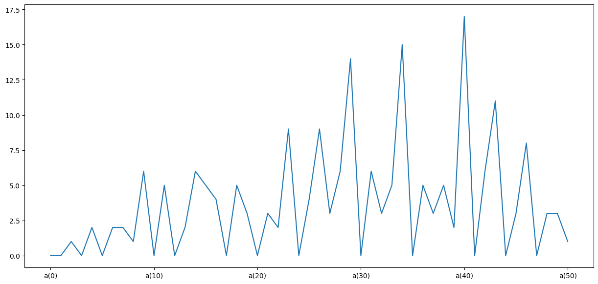
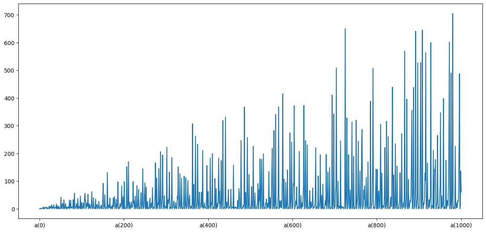
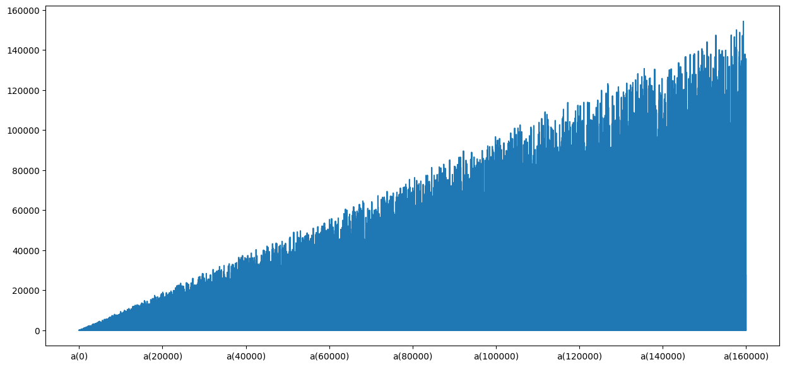

## What is [Van Eck sequence?](https://oeis.org/A181391)

This repository is dedicated to visualizing Van Eck sequence using Python with Pandas.  

```py
def eck(k,lista=False):
    graf = {'a(0)': 0} ; cont = 1
    vaneck=[0]
    for x in range(k):
        if vaneck[-1] in vaneck[:-1]:
            vaneck.append(len(vaneck[::-1][1:][:vaneck[::-1][1:].index(vaneck[-1])+1])) 
        else: vaneck.append(0)
        graf['a('+str(cont)+')'] = vaneck[-1]
        cont+=1
    if lista: return vaneck
    else: return graf
```

`eck(50)`


`eck(1000)`


`eck(20**4)`
